# Writely

A full-stack blog publishing platform built with React, Node.js, Express, PostgreSQL, and Prisma.

Writely separates the public reading experience from the author/admin workspace while sharing a single REST API and database. Readers can discover and comment on published posts, authors can create and manage content, and the owner can review requests for admin access.

## Live Application

| Application | URL |
|---|---|
| Reader | https://blogapi-1-nzcm.onrender.com |
| Admin | https://admin-frontend-zxbz.onrender.com |
| Backend API | https://blogapi-mpfp.onrender.com |

> The Reader and Admin applications are separate React SPAs backed by the same Express API and PostgreSQL database.

## Features

### Reader

- Browse published blog posts
- Paginated post listing
- Search posts by title
- View individual posts
- View author and publication information
- Register and log in
- Persistent authentication with access and refresh tokens
- Create, edit, and delete your own comments
- Submit a request for admin access

### Admin

- Dashboard with post statistics
- View your posts
- Filter posts by published/unpublished state
- View featured posts
- Create and edit posts
- Save posts as drafts or publish them
- Mark posts as featured
- Rich-text content editing with Tiptap
- Automatically generated unique slugs
- Manage your own posts
- Manage your own comments

### Owner

- All author/admin post-management capabilities
- Review pending admin-access requests
- Approve or reject admin requests
- Promote an approved reader to `ADMIN`

### Backend

- REST API built with Express 5
- PostgreSQL persistence through Prisma ORM
- JWT authentication
- Short-lived access tokens
- Rotating refresh tokens
- Server-side refresh-token hashes
- Session revocation
- Role-based authorization
- Request validation with `express-validator`
- Post HTML sanitization using DOMPurify + JSDOM
- Admin-request email notifications through Resend

## Screenshots

### Reader Frontend

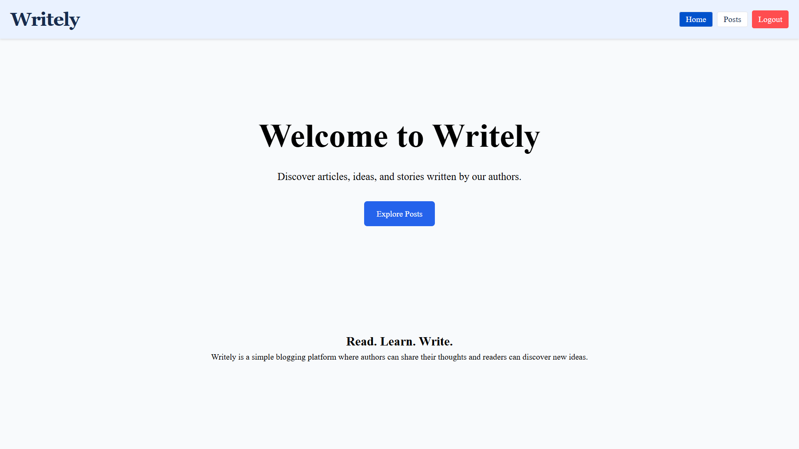

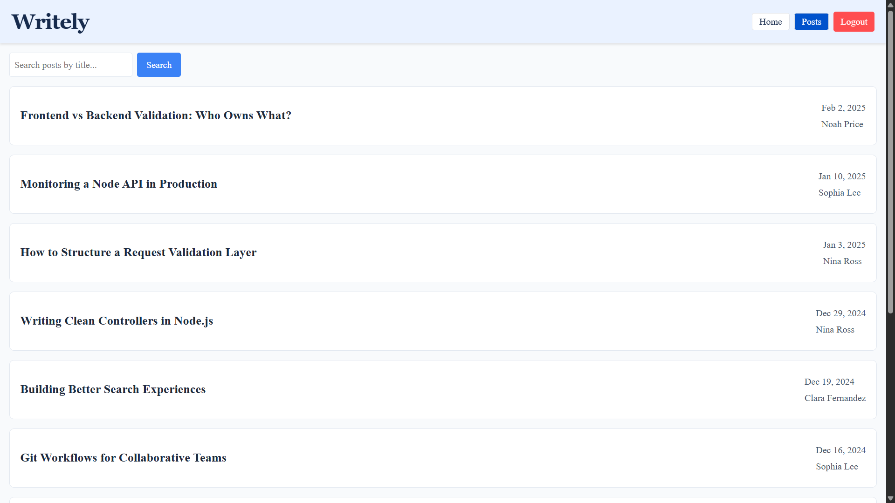

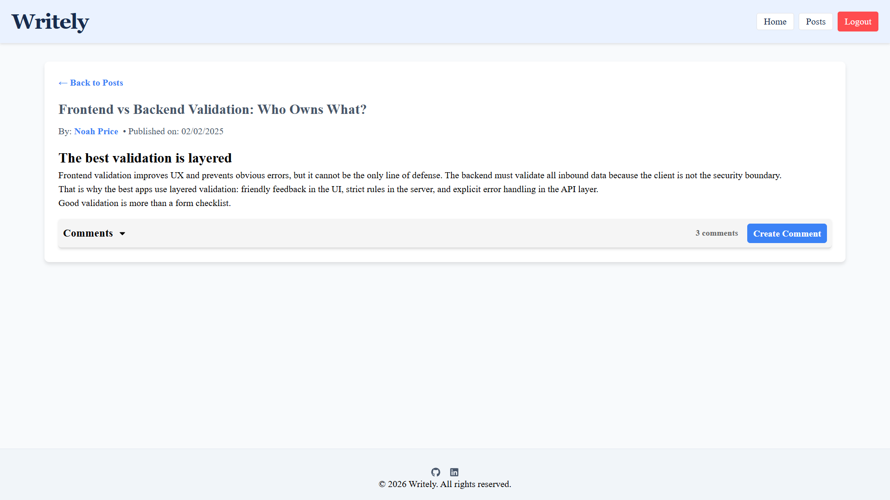

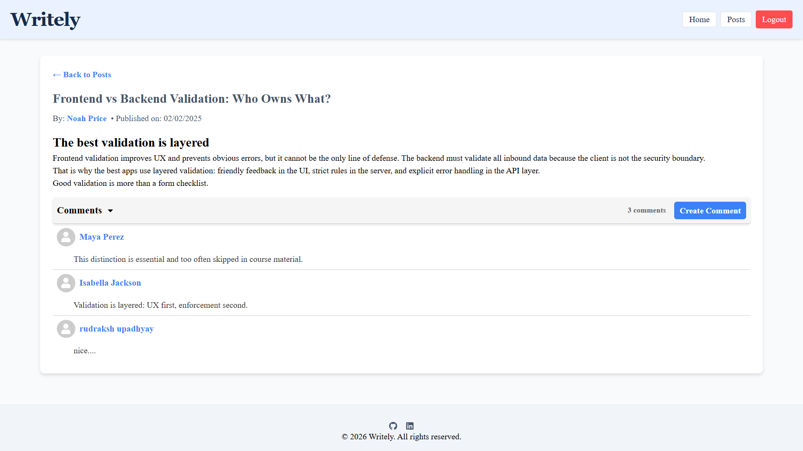

### Admin Frontend

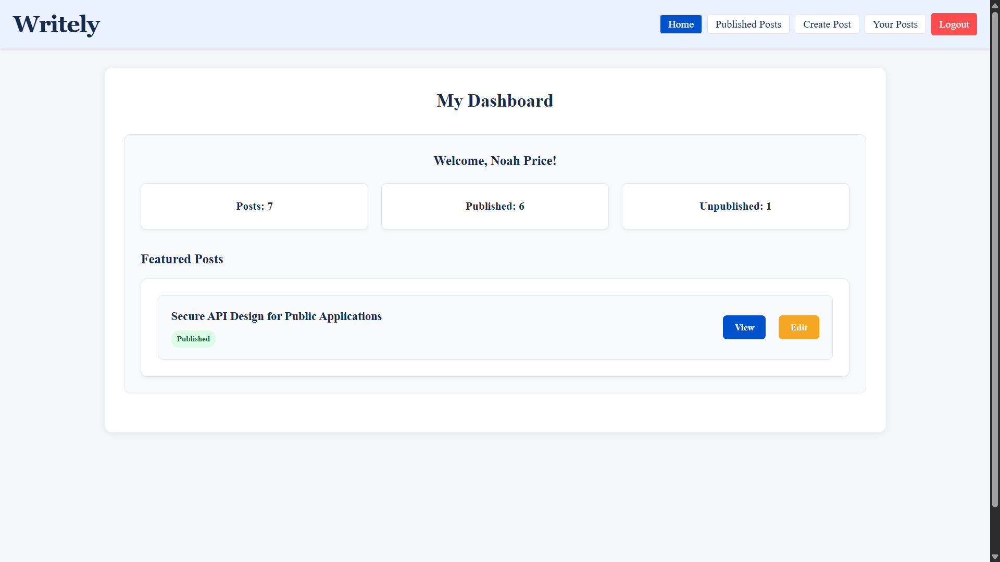

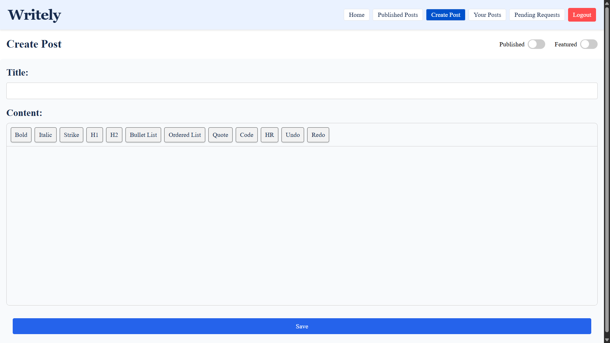

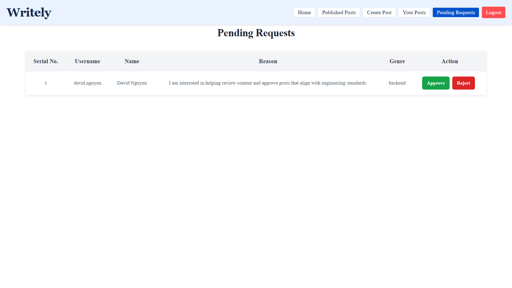

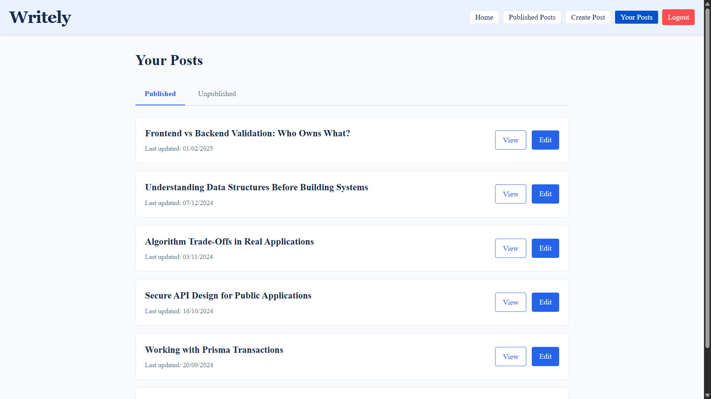

## Demo Video

[](https://youtu.be/2MoPpXM6gwU)

A short walkthrough of the application covering authentication, post management, comments, and the admin workflow.

## Architecture

Writely is organized as three independently configured applications:

```text
                              WRITELY ARCHITECTURE

       ┌─────────────────────────┐       ┌─────────────────────────┐
       │     Reader Frontend     │       │     Admin Frontend      │
       │       React + Vite      │       │       React + Vite      │
       │                         │       │                         │
       │ • Public posts          │       │ • Dashboard             │
       │ • Search & pagination   │       │ • Create / edit posts   │
       │ • Authentication        │       │ • Statistics            │
       │ • Comments              │       │ • Featured posts        │
       │                         │       │ • Admin requests        │
       │                         │       │ • Rich text editor      │
       └────────────┬────────────┘       └────────────┬────────────┘
                    │                                 │
                    │          REST API               │
                    │                                 │
                    │  JWT Access Token               │
                    │  HTTP-only Refresh Cookie       │
                    │                                 │
                    └───────────────┬─────────────────┘
                                    │
                                    ▼
                    ┌──────────────────────────────┐
                    │          Backend API         │
                    │       Node.js + Express      │
                    │                              │
                    │ • Authentication & Sessions  │
                    │ • JWT Access / Refresh       │
                    │ • Role-Based Access Control  │
                    │ • Posts & Comments           │
                    │ • Admin Request Workflow     │
                    │ • Validation & Sanitization  │
                    └──────────────┬───────────────┘
                                   │
                                   │ Prisma ORM
                                   ▼
                    ┌──────────────────────────────┐
                    │       PostgreSQL / Neon      │
                    │                              │
                    │ • Users                      │
                    │ • Sessions                   │
                    │ • Posts                      │
                    │ • Comments                   │
                    │ • Admin Requests             │
                    └──────────────────────────────┘
                                   │
                                   │
                    ┌──────────────▼───────────────┐
                    │        Resend Email API      │
                    │                              │
                    │ • Admin request notification │
                    │ • Owner email                │
                    └──────────────────────────────┘
```

### Application responsibilities

**Reader Frontend**

Provides the public-facing blog experience, authentication UI, post browsing, post details, search, and authenticated commenting.

**Admin Frontend**

Provides the author/admin workspace, post management, dashboard statistics, rich-text editing, and owner-only admin-request review.

**Backend**

Provides the REST API, authentication and session handling, authorization, validation, post/comment operations, admin-request workflow, email notifications, and database access.

**Database**

PostgreSQL stores users, sessions, posts, comments, and admin requests.

## Authentication

Writely uses a custom JWT-based authentication flow rather than Passport.

### Token model

- Access token lifetime: **15 minutes**
- Refresh token lifetime: **7 days**
- Access token is returned to the frontend and sent in the `Authorization: Bearer <token>` header.
- Refresh token is stored in an HTTP cookie.
- Refresh tokens are hashed with SHA-256 before being stored in the `Session` table.
- Refresh tokens are rotated when they are refreshed.
- Sessions can be revoked individually or all at once.

### Authentication flow

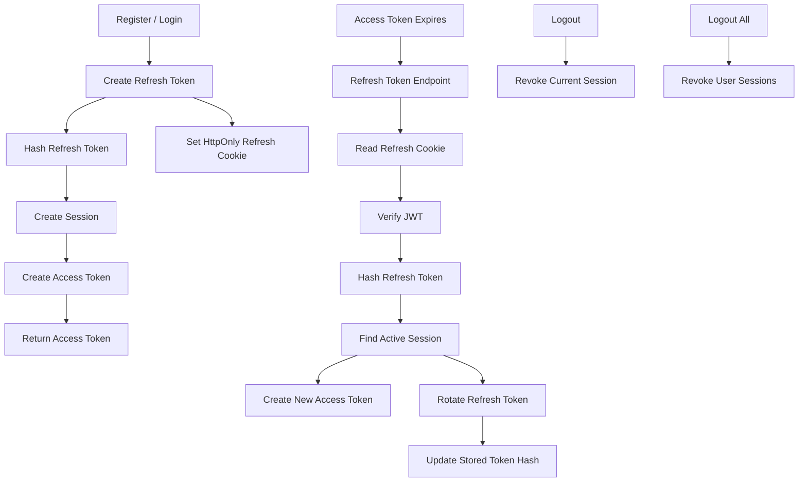

The frontends also restore authentication after reload by using the refresh-token endpoint and then retrieving the current user.

## Role-Based Access Control

Writely uses three application roles:

| Role | Capabilities |
|---|---|
| `READER` | Browse published posts, authenticate, comment, manage own comments, request admin access |
| `ADMIN` | Create and manage posts, publish/unpublish, feature posts, view own post statistics and lists |
| `OWNER` | Admin capabilities plus review and approve/reject admin-access requests |

Authorization is enforced on the backend through authentication and role-authorization middleware rather than relying only on frontend route visibility.

## Admin Access Request Workflow

A reader can request elevated access through the admin frontend.

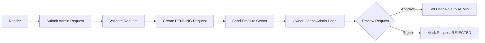

Each request stores:

- Request ID
- User
- Reason
- Optional genre
- Status
- Creation timestamp
- Update timestamp
- Expiration timestamp

The current implementation prevents a reader from creating another request while they already have a pending request.

When a new request is created, the backend sends an email notification to the configured owner through Resend. The email contains a link to the admin request review page.

## Posts

Posts support:

- Title
- Rich HTML content
- Unique slug
- Published/unpublished state
- Featured state
- Author ownership
- Creation/update timestamps
- Publication timestamp

### Publishing behavior

A newly published post receives a `publishedAt` timestamp.

When a published post is changed back to draft/unpublished, `publishedAt` is cleared.

Post content is sanitized on create and update before being stored.

### Public visibility

The public post feed only returns published posts.

Individual post retrieval supports authentication so an author can access their own unpublished post.

Published posts can be searched by title and retrieved with pagination.

## Comments

Authenticated users can:

- Create comments on posts
- Edit their own comments
- Delete their own comments

Comment content is validated for required content and a maximum length of 500 characters.

Comments are associated with both their post and author and are deleted automatically when the related post is deleted.

## Database Design

The database is PostgreSQL, accessed through Prisma.

### Entity relationship

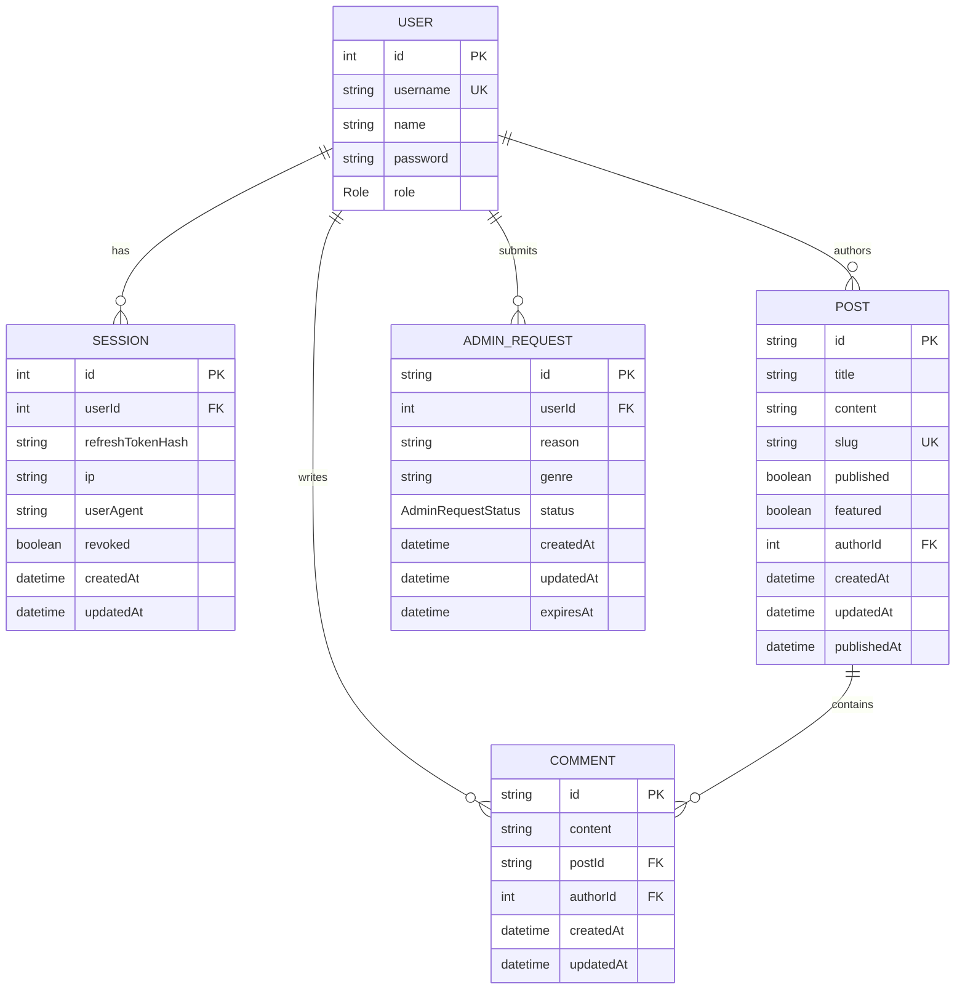

### Prisma models

- `User`
- `Session`
- `Post`
- `Comment`
- `AdminRequest`

### Enums

```text
Role
├── READER
├── ADMIN
└── OWNER

AdminRequestStatus
├── PENDING
├── APPROVED
└── REJECTED
```

Important constraints and indexes include:

- Unique `User.username`
- Unique `Post.slug`
- Indexes on session ownership and refresh-token hashes
- Indexes on post authorship
- Indexes on comment post/author relationships
- Indexes on admin-request user and status

Relations use cascade deletes where defined in the Prisma schema.

## REST API

Base URL in production:

```text
https://blogapi-mpfp.onrender.com/api
```

### Authentication

| Method | Endpoint | Purpose |
|---|---|---|
| `POST` | `/auth/register` | Register a new reader |
| `POST` | `/auth/login` | Authenticate a user |
| `GET` | `/auth/get-me` | Retrieve the current authenticated user |
| `GET` | `/auth/refresh-token` | Refresh access token and rotate refresh token |
| `GET` | `/auth/logout` | Revoke the current session |
| `GET` | `/auth/logout-all` | Revoke all sessions for the user |

### Posts

| Method | Endpoint | Access | Purpose |
|---|---|---|---|
| `GET` | `/posts` | Public | List published posts with search and pagination |
| `GET` | `/posts/mine` | `ADMIN`, `OWNER` | List the current user's posts |
| `GET` | `/posts/mine/statistics` | `ADMIN`, `OWNER` | Get published/unpublished/total post counts |
| `GET` | `/posts/mine/featured` | `ADMIN`, `OWNER` | List the current user's featured posts |
| `GET` | `/posts/:slug` | Authenticated | Retrieve a post by slug |
| `POST` | `/posts` | `ADMIN`, `OWNER` | Create a post |
| `PATCH` | `/posts/:slug` | `ADMIN`, `OWNER` | Update a post |
| `DELETE` | `/posts/:slug` | `ADMIN`, `OWNER` | Delete a post |

The public post-list endpoint accepts pagination and search parameters, including `page`, `limit`, and `search`.

### Comments

| Method | Endpoint | Access | Purpose |
|---|---|---|---|
| `POST` | `/comments/:postId` | Authenticated | Create a comment |
| `PATCH` | `/comments/:commentId` | Authenticated | Update a comment |
| `DELETE` | `/comments/:commentId` | Authenticated | Delete a comment |

### Admin Requests

| Method | Endpoint | Access | Purpose |
|---|---|---|---|
| `POST` | `/admin-request` | `READER` | Submit an admin-access request |
| `GET` | `/admin-request` | `OWNER` | Retrieve pending requests |
| `PATCH` | `/admin-request/:requestId` | `OWNER` | Approve or reject a request |

## Project Structure

The repository contains three independently configured applications rather than a root-level workspace.

```text
BlogAPI/
├── backend/
│   ├── prisma/
│   │   ├── schema.prisma
│   │   ├── seed.js
│   │   ├── migrations/
│   │   └── seed-data/
│   ├── src/
│   │   ├── config/
│   │   ├── controllers/
│   │   ├── middleware/
│   │   ├── routes/
│   │   ├── services/
│   │   └── utils/
│   ├── lib/
│   ├── server.js
│   └── package.json
│
├── reader-frontend/
│   ├── src/
│   │   ├── components/
│   │   ├── context/
│   │   ├── pages/
│   │   ├── services/
│   │   └── utils/
│   └── package.json
│
└── admin-frontend/
    ├── src/
    │   ├── api/
    │   ├── components/
    │   ├── context/
    │   ├── pages/
    │   ├── services/
    │   └── utils/
    └── package.json
```

## Technology Stack

### Reader Frontend

- React 19
- Vite 8
- React Router 8
- React Icons
- CSS Modules

### Admin Frontend

- React 19
- Vite 8
- React Router 8
- Tiptap
- React Icons
- CSS Modules

### Backend

- Node.js
- Express 5
- Prisma 7
- PostgreSQL
- JSON Web Tokens
- bcrypt
- cookie-parser
- CORS
- express-validator
- DOMPurify
- JSDOM
- Resend

### Infrastructure

- Render
- Neon PostgreSQL

## Content Sanitization

The admin editor produces HTML content. Before posts are created or updated, the backend sanitizes the content with DOMPurify running through JSDOM.

This provides a server-side sanitization step before rich-text HTML is persisted.

## Environment Variables

The backend reads configuration from environment variables.

Typical backend variables include:

```env
DATABASE_URL=
JWT_SECRET=
PORT=
ADMIN_PASSWORD=
READER_PASSWORD=
READER_ORIGIN=
ADMIN_ORIGIN=
RESEND_API_KEY=
OWNER_EMAIL=
```

Both Vite frontends use:

```env
VITE_API_URL=
```

The reader frontend also supports:

```env
VITE_PAGE_LIMIT=
```

Do not commit real credentials or secrets.

## Local Development

Each application is configured independently.

### 1. Clone the repository

```bash
git clone https://github.com/rudrakshupadhyay/BlogAPI.git
cd BlogAPI
```

### 2. Backend

```bash
cd backend
npm install
```

Configure the required backend environment variables, then generate Prisma Client and apply the database migrations.

```bash
npx prisma generate
npx prisma migrate deploy
```

To seed the database:

```bash
npm run seed
```

Start the backend in development mode:

```bash
npm run dev
```

The backend also exposes the production start script:

```bash
npm start
```

### 3. Reader Frontend

From the repository root:

```bash
cd reader-frontend
npm install
npm run dev
```

### 4. Admin Frontend

From the repository root:

```bash
cd admin-frontend
npm install
npm run dev
```

The frontend Vite development servers will print their local URLs when started.

## Production Deployment

The production deployment uses separate Render services for the two frontends and the API, with Neon providing PostgreSQL.

### Backend

**Platform:** Render Web Service

**URL:**

```text
https://blogapi-mpfp.onrender.com
```

**Root Directory:**

```text
backend
```

**Build Command:**

```bash
npm install && npx prisma generate && npx prisma migrate deploy
```

**Start Command:**

```bash
node server.js
```

The production database is hosted on Neon PostgreSQL and is connected through `DATABASE_URL`.

### Reader Frontend

**Platform:** Render Static Site

**URL:**

```text
https://blogapi-1-nzcm.onrender.com
```

### Admin Frontend

**Platform:** Render Static Site

**URL:**

```text
https://admin-frontend-zxbz.onrender.com
```

**Root Directory:**

```text
admin-frontend
```

**Build Command:**

```bash
npm install && npm run build
```

**Publish Directory:**

```text
dist
```

Because the admin application is a React SPA, Render is configured with the following rewrite:

```text
/*
→ /index.html
```

This allows client-side routes such as `/login` and `/pending-requests` to work correctly when loaded directly or refreshed.

### Production request flow

```text
https://blogapi-1-nzcm.onrender.com
                │
                ▼
      Render Static Site
                │
                │ API requests
                ▼
https://blogapi-mpfp.onrender.com
                │
                ▼
          Express API
                │
                ▼
        Neon PostgreSQL
```

The admin application follows the same backend path:

```text
https://admin-frontend-zxbz.onrender.com
                │
                ▼
      Render Static Site
                │
                │ API requests
                ▼
https://blogapi-mpfp.onrender.com
                │
                ▼
          Express API
                │
                ▼
        Neon PostgreSQL
```

CORS is configured using the deployed reader and admin origins, and authentication requests use credentials so the refresh-token cookie can be used by the browser.

## Security Notes

The project includes several application-level security mechanisms:

- Passwords are hashed using bcrypt.
- Access tokens are short-lived.
- Refresh tokens are stored in HTTP cookies rather than normal frontend storage.
- Refresh-token hashes are stored in the database instead of raw refresh tokens.
- Refresh tokens are rotated on refresh.
- Sessions can be revoked.
- Backend authorization checks user roles.
- Post operations enforce author ownership or owner privileges.
- Request data is validated with `express-validator`.
- Rich HTML post content is sanitized server-side with DOMPurify + JSDOM.
- Production cookies are configured with the `Secure` flag.
- CORS is restricted to the configured reader and admin origins.

This is a portfolio project, so the production deployment is intentionally focused on practical application architecture rather than a large-scale infrastructure stack.

## Seed Data

The backend includes Prisma seed support and seed-data modules for:

- Users
- Posts
- Comments
- Admin requests

The seed process creates an owner account and sample application data using configured environment values for seed passwords.

Never commit real production credentials to the repository.

## Database Migrations

The repository includes Prisma migrations covering the evolution of the application schema, including:

- Initial schema
- Username indexing
- Refresh-token hash indexing
- Blog models
- Blog model modifications
- Admin requests and role support

Production deployment runs:

```bash
npx prisma migrate deploy
```

so checked-in migrations can be applied to the production database.

## Current Project Scope

The current implementation focuses on the core blog workflow:

```text
Reader
  │
  ├── Browse posts
  ├── Search posts
  ├── Read published content
  ├── Register / Login
  ├── Comment
  └── Request Admin Access
             │
             ▼
           Owner
             │
      Approve / Reject
             │
             ▼
           Admin
             │
      ├── Create posts
      ├── Edit posts
      ├── Publish / Unpublish
      └── Feature posts
```

## Known Limitations

The repository currently does not include:

- Automated test suites
- Docker or Docker Compose configuration
- CI/CD workflow configuration
- Infrastructure-as-code configuration
- A committed production environment file
- A separate API specification such as OpenAPI/Swagger

These are documentation and infrastructure gaps rather than dependencies required by the current application architecture.

## Future Improvements

Potential future work can include:

- Automated unit and integration tests
- API documentation with OpenAPI
- Additional security hardening and rate limiting
- More advanced post discovery and filtering
- Richer analytics
- More granular moderation permissions
- Automated deployment/CI workflows

## Repository

GitHub:

https://github.com/rudrakshupadhyay/BlogAPI

## Author

**Rudraksh Upadhyay**

- GitHub: https://github.com/rudrakshupadhyay

## License

Educational portfolio project by Rudraksh Upadhyay.

---

> Built as a full-stack application to explore production-style authentication, authorization, relational data modeling, content management, and deployment of multiple frontend applications behind a shared backend API.
